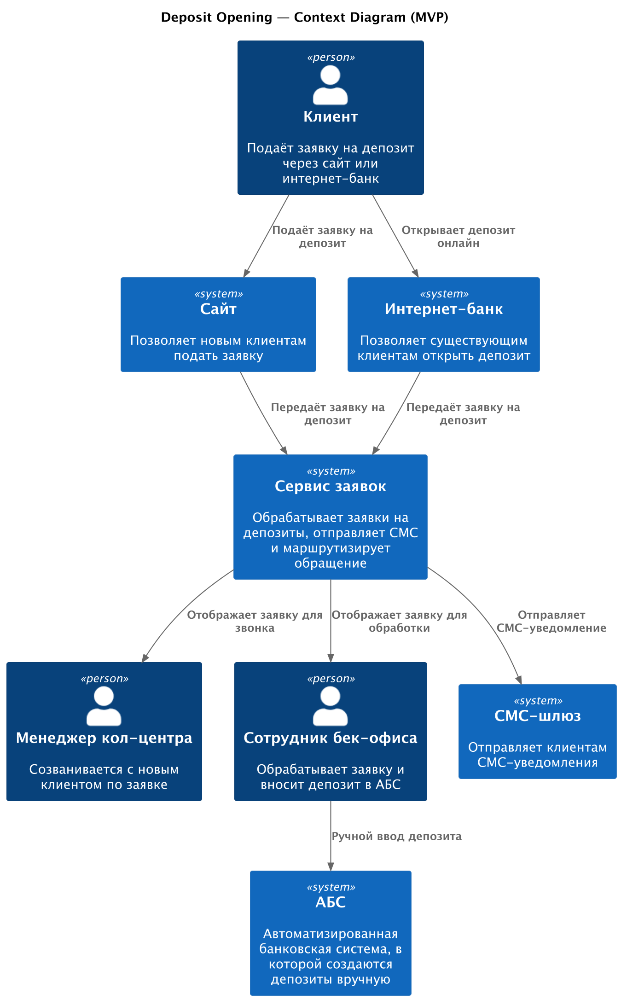
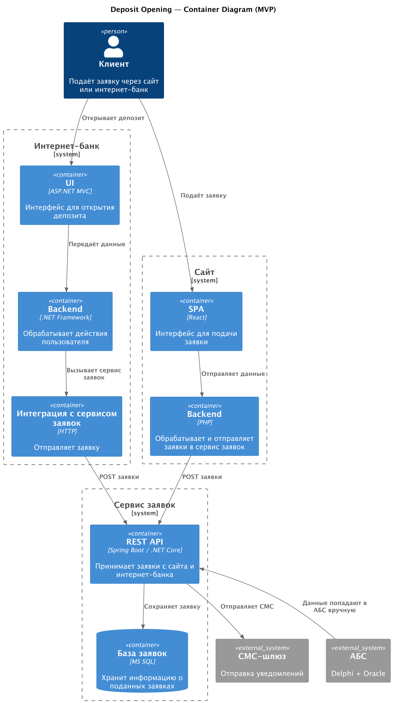

### Название задачи
Открытие депозитов онлайн — MVP

### Автор
Никита Щербо

### Дата
03-06-2025

### Функциональные требования

| **№** | **Действующие лица или системы**               | **Use Case**        | **Описание**                                                                  |
|:-----:|------------------------------------------------|---------------------|-------------------------------------------------------------------------------|
|   1   | Клиент, Сайт, Сервис заявок, Кол-центр         | Заявка с сайта      | Клиент заполняет форму -> заявка попадает в сервис -> менеджер звонит клиенту   |
|   2   | Клиент, Интернет-банк, Сервис заявок, бек-офис | Открытие депозита   | Клиент выбирает счёт и сумму -> заявка уходит в сервис -> бек-офис вносит в АБС |
|   3   | Сервис заявок, СМС-шлюз                        | Уведомление клиента | Клиент получает СМС после обработки заявки и открытия депозита                |

### Нефункциональные требования

| **№** | **Требование**                                                     |
|:-----:|--------------------------------------------------------------------|
|   1   | Использование текущих технологий (MS SQL, Oracle, .NET, Java)      |
|   2   | Защищённая передача данных (HTTPS + шифрование)                    |
|   3   | Исключение прямого доступа к АБС из внешних систем                 |
|   4   | Высокая доступность: 99.9% / отказоустойчивость / резервный ЦОД    |
|   5   | Быстродействие операций                                            |
|   6   | Расширяемость решения (возможность полной автоматизации в будущем) |

### Решение

Архитектура MVP включает в себя Сервис заявок как центральный компонент, принимающий запросы от сайта и интернет-банка, взаимодействующий с кол-центром, бек-офисом и СМС-шлюзом.

#### Диаграмма контекста

[Исходник](./context.puml)  

  

#### Диаграмма контейнеров

[Исходник](./container.puml)

**Аргументация выбора:**
- Исключаем прямую нагрузку на АБС — заявки обрабатываются вручную
- Используем текущую инфраструктуру .NET/Java
- Заложена база для микросервисной архитектуры
- Простой путь расширения к полной автоматизации

### Альтернативы

- **Прямая интеграция интернет-банка с АБС** — отклонено из-за перегруженности АБС.
- **Использование Kafka или очередей в MVP** — признано избыточным на этом этапе.

### Недостатки, ограничения, риски

- Продолжает использоваться ручной ввод в АБС -> риск задержек и ошибок
- Excel-файлы остаются источником ставок — уязвимость и неточность
- Сервис заявок становится точкой отказа
- Нет полной автоматизации на этапе MVP
