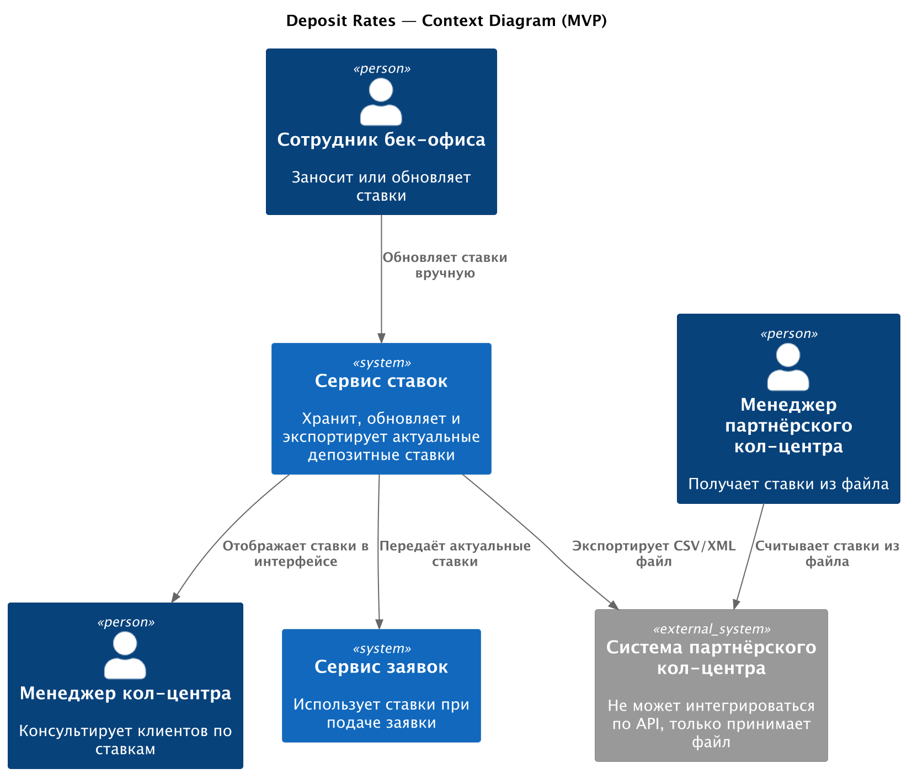
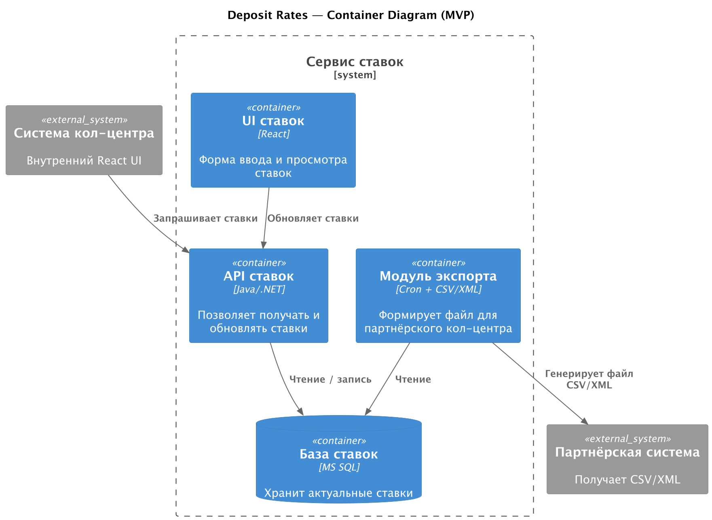

### Название задачи
Передача ставок в кол-центр

### Автор
Никита Щербо

### Дата
03-06-2025

### Функциональные требования

| **№** | **Действующие лица или системы**               | **Use Case**               | **Описание**                                                                        |
|:-----:|------------------------------------------------|----------------------------|-------------------------------------------------------------------------------------|
|   1   | Менеджер кол-центра, Сервис ставок             | Просмотр актуальных ставок | Сотрудник видит действующие ставки через внутренний интерфейс                       |
|   2   | Менеджер партнёрского кол-центра, Файл XML/CSV | Получение ставок по файлу  | Партнёрский кол-центр загружает ставки в виде файла                                 |
|   3   | Сотрудник бек-офиса, Сервис ставок             | Обновление ставок          | Менеджер вручную обновляет данные ставок через интерфейс или импортирует Excel      |
|   4   | Сервис заявок                                  | Использование ставок       | Использует ставки из общей базы для отображения и расчёта условий при подаче заявки |

### Нефункциональные требования

| **№** | **Требование**                                                                |
|:-----:|-------------------------------------------------------------------------------|
|   1   | Разделение доступа: партнёрский кол-центр не должен видеть внутренние системы |
|   2   | Формат выгрузки — файл CSV/XML, регулярная генерация                          |
|   3   | Минимальное изменение текущего процесса (всё ещё Excel-основа в MVP)          |
|   4   | Возможность расширения до API в будущем                                       |
|   5   | Лёгкая интеграция со сторонними системами                                     |

### Решение

В рамках MVP создаётся отдельный Сервис ставок, который агрегирует данные ставок, предоставляет их по внутреннему API и формирует регулярные выгрузки для партнёрского кол-центра.

#### Диаграмма контекста

[Исходник](./context.puml)  

#### Диаграмма компонентов

[Исходник](./container.puml)  

**Аргументация выбора:**
- Централизация данных ставок упрощает поддержку и контроль
- Партнёры получают только то, что им нужно, без доступа к внутренним системам
- Снижается нагрузка на бек-офис за счёт единообразного интерфейса ставок
- Возможность развивать автоматизацию без смены модели

### Альтернативы

- **Прямая передача Excel-файла партнёрам** — отклонено из-за проблем с безопасностью и масштабируемостью.
- **Интеграция через API** — невозможна из-за ограничений на стороне партнёрского кол-центра (нельзя использовать SFTP или REST).

### Недостатки, ограничения, риски

- Обновление ставок по-прежнему происходит вручную -> риск несвоевременности данных
- Выгрузка файла требует мониторинга (по расписанию)
- Необходимо разграничивать доступ для разных типов кол-центров
- Требуется организационная договорённость о формате передачи ставок

# Список крупных задач

|        **ID**         | **Название задачи**                                   | **Квартал** | **Описание**                                                        |
|:---------------------:|-------------------------------------------------------|-------------|---------------------------------------------------------------------|
|     Сервис ставок     |
|          T1           | Проектирование API                                    | Q3          | Проектирование модели ставок и интерфейсов                          |
|          T2           | Реализация UI                                         | Q3          | Интерфейс для обновления и просмотра ставок                         |
|          T3           | Экспорт в CSV/XML                                     | Q3          | Формирование файлов для передачи партнёру                           |
|          T4           | Cron-выгрузки                                         | Q3          | Автоматизация экспорта на уровне расписания                         |
|          T5           | Права доступа                                         | Q4          | Разделение доступа между внешними и внутренними пользователями      |
|          T6           | Стабилизация и тестирование сервиса ставок            | Q4          | Завершение работ, стабилизация, проверка корректности и мониторинг  |
|       Кол-центр       |                                                       
|          T7           | Интеграция с API ставок                               | Q3          | Подключение к сервису ставок                                        |
|          T8           | Обновление UI                                         | Q3          | Отображение ставок в интерфейсе операторов                          |
|          T9           | Стабилизация, обратная связь по кол-центру            | Q4          | Проверка, сбор обратной связи от операторов                         |
| Партнерский кол-центр |                                                       |
|          T10          | Разработка и согласование формата                     | Q3          | Утверждение структуры и формата выгрузки (CSV/XML)                  |
|          T11          | Автоматизация импорта                                 | Q4          | Обработка выгрузок и загрузка на стороне партнёра                   |
|          T12          | Стабилизация, тестирование по партнерскому кол-центру | Q4          | Проверка на корректность, обратная связь, отладка процессов         |
|     Интернет-банк     |                                                       
|          T13          | Доработки для поддержки логики ставок                 | Q3          | Обновление отображения персонализированных ставок при необходимости |
|         Сайт          | 
|          T14          | Отображение доступных публичных ставок                | Q3          | Добавление блока ставок на сайт                                     |

# Roadmap

Сделан с использованием практик диаграммы Ганта - ведь некоторые задачи зависят друг от друга

[Roadmap](https://viewer.diagrams.net/?tags=%7B%7D&lightbox=1&highlight=0000ff&edit=_blank&layers=1&nav=1&title=RoadMap_bank_Standart.drawio&dark=auto#R%3Cmxfile%20pages%3D%222%22%3E%3Cdiagram%20id%3D%221zcTAVt1k4KSup7FvAfL%22%20name%3D%22Roadmap%22%3E7VzZcts2FP0azbQPzIAgweVRq9MlbTxW2%2FSpQ0uUxClFKhQdWfn6YidIQI5sR4zrwJ7IwAUIkTgHdwOYgTfe3l9VyW7zrlym%2BQCC5f3AmwwgRF4A8B8iOTKJF6GYSdZVtmQytxHcZJ9TLuQXru%2ByZbpvdazLMq%2BzXVu4KIsiXdQtWVJV5aHdbVXm7W%2FdJetUE9wsklyX%2FpUt6w1%2FDA%2BApuFtmq03%2FKtxE3%2FAbSJ68677TbIsD4rImw68cVWWNStt78dpTqZPTIw3CWeTK5h8GMZXgRv980tZrB022Owxl8hnqNKifvLQh6uqHL114c0xdH5fj%2Fa%2FgdXPDmRDf0ryOz5h%2FFnro5hB%2FNg7UqwoPKNVlufjMi8r2uqtViu4WGD5vq7Kf1PRUpRFSjqXRc05AX1c39TbHJddXDxssjq92SUL0njA7MOyJM%2FWBa7m6Yp81ae0qjMM5ZCL65J02uNrsmKN6wjXqvKuWKbkEQGunTlRfELJ%2BOm9whM%2BcVdpuU3r6oi78FYHIkEYvhCc2OOCQ0MrNxC03yiUciMuTDiX13L8Bi5c4Ig9Aj3fovdE9FzXD95E5wIYy75fHUKkQTjHDwMc%2FG%2BAJyWeDfB8R7Q8mtJPRD%2BHVA5pOdL6MDmTTEQfei0Ew%2Fc%2FPZolaWBgCW5ZhvEtAG2quNH%2Fmip%2BrFHFsNJDZOCJd6l1HurrHM%2FC0BV8kOirfHAphWihoYrabcqJ1CVDe6ZN8CnodqmCyC8nhCJnPyYKBfTHQKHLQRx4Z2oD2LMyiIw4x0MFrpFD0QwUVTAR%2BFIaWDSNltkI5cUMc6wBee3hOv5FJ3Xvvk4JGru0yvBNpBUXvW%2FqX0bvPhUuOKnveRE8gOz5CNI6v21X0eELjCi9uzbTTlGmTyMPfYPmjgxMCP03%2FvOpEDvXn9OPh6u%2F9%2FMCwF1%2BPf8Ucqf8lfloGiznIvoY%2BMJ%2BPWwjeq6OHvfKmDFlllea10nbIjPjy7w16YPF3LUbvR61fgk6aGrdSIeLqXUjG15ltNzLWkYvYC175rUctVdbx6NWVzR0aMXVgqsX7kP3sjyNCPe7PF9lOqSX5em9gOWpZ0KUIBdw08kWqV1tRsD6XW2Bhte1b2McJca5ABHcIHqJMY6en5pDJYk5BIpby8ojxSEOFWc6UBJYM3z5H68mV3kJtaDnKkFsYMOlcpVGLug5rLmnckF4TE1wNBNxkBJMQZGohGB88ye%2BkQ%2FvfrVMOK0X4gh1mYB0JvgB6pEJehJs7nMmjKuycEQqGgPO1IGnUMBTVIOIni3%2Bj8Hf%2Fdb4ixtQCYAGJ%2Fa21I0JIJa%2Fr2gGV0mHeIrewJ2DZEtmvrjd7%2BgkB3nNgChafAk%2B3pGt%2BtGCMQEHbaBa3yY%2F4BHwA4LOnx%2FpUIBQxFkl2yw%2Fsku2ZVHuGS9kO3NCSCvY3TM5Rrh2CG%2BcbbnkjUXJidTcCy6t2V%2FUPYWB8FQTKT1gIGti6hGdfCyZkDLx%2FBCZbIQR%2B1JfV%2FYVvHvSMLAZhiEsW4jCRxRnREeckI%2FhRJRIuIwm5C7IHhWXzWRpKluBLMHWUCNWpYYBcdMgboXBLW%2BFqQhSpUoCFxQ1IXoJVUFaVWUh27nCoFcLlUEasdIgMqo2aJ1WFdVBhBRzImfqg4ioAiGitgohTUSJ0PvgaoTIEJUIVUIk7F4UAJhKOQdi2STRbfQJIhpF9uRaRQx0VFuodREtTMPIVqplRBvXNLLRU67DGkfKidZRfEXQMg58RWMtxBa1WDPWHpwfJ5h2sb2wT8%2FQ1ZPp80B1DfWNalcJE84NGYSzALSMnjr%2Bo85MWANjDYw1MNbAWAMjDQyCXQNjSj3IvGU%2FBgZqBoYiDkNmZTpq%2FOTmjxqKPmBm%2BBkrep7uaSetLJ9Op7JiQ%2FzabybLNW8YDmF0kk5TxWuZaL7FqL273zqVaROdD7FDJrMEO6Lgm7ND322cx1%2Fdmx1%2FVT92LNxjydOOklNPsYCuqmsM5kzcNi6PrXts3WPrHlv32Bqsh9zjyODO9OwdnzhgQV%2FV6%2B7VAkXDA82ETRVjMWyn7KO2vZgKb1qaPL31oZdVaGd1G4B1G2s2C7Q7y%2FMi8nvFd2nWypL4bJ88MIR4xhxicDES66dO5m7rhSlVc6nRl06Zs1OJzeXtTWrOO%2BvuWHfHujvW3fl%2BLYW%2B3RSEBkuBDKcPLmcpDIfSSILQBujWYlmLZS2WtVjftcVC3RP1AdAtVs8Buvn1bxyg%2B4rZagXfRjOBPzvvEXZCanDeybqJOJqJP%2BWFM6Wb2zaUWB6euNDujT0nDne7cbhnPNvZaxxuONxr43Dr1Vivxno11qv5dpYigm86LwL4pvdAkOz2TGuBq81%2FgEfbFF3mTf8D%3C%2Fdiagram%3E%3Cdiagram%20id%3D%226faDem5PxRRIMGQd80wj%22%20name%3D%22Roadmap_change%22%3E7Zpfb9o6FMA%2FTR6Z%2FCcJ5BEobHuY1Km9mnTfUmIgWohRSAvdp5%2FtOOYkNi3cy7YwhRbLPj62g%2F1zzjlOPDrdHD4W8Xb9hScs8whaFWni0TuPECy%2BQrCNV6whkBoP6Y9aiLT0OU3YrqFYcp6V6bYpXPA8Z4uyIYuLgu%2Bbakue2ZfxsIgzZkm%2FpUm5rqSUInSs%2BMTS1VqPJKqiqmYT19padbeOE74HIjrzSOgReog9OvGkrPlPpwXn5btqtfLmMGWZnNp6Yqtx5%2F%2B9A%2FPjC5aXV%2Brza7afIPQDDXj5hILwe%2FLPt38HWM%2FZS5w964nXc1a%2B1ishpm8rs4Va1ckyzbIpz3ihaulyuSSLhZDvyoJ%2FZ3VNznMmlXleapSIL8rrcpOJPBbZ%2FTot2cM2XsjKvSBUyOIsXeWimLGlHOqFFWUqkBhrccml0k60SfOVKAeiVPDnPGHyNyI1IerXiHbscHIq8TkMtGfzI%2BMbVhavoqx7HpCghvFVSwKqBfsjsjisOVwDXHGkhbHeFivT%2F0XLLHT1Sl8ZjFEPxhXBGJ4PxqjjYAx7MK4IRuQEA98gGLTn4opcYOyHH0bnohEZ3Y7C4VtwPIq5QwPxHd9%2Flj2JlRxhT0z9JFB5pPJEpSNQq4bVQpHeqSpSNxQpBc2rbkOgP6qb%2B6DJXKUzlQ7BiATIiW4YVam6mDG%2BGHEWOhAXNckwekKoybmwwX8b5%2F7I4rw2goByGjkgD7p9%2BwtswokmXAEzt9gOAIcVqENAuCiaKpFGKp04gJRbQLd6mD%2FeD97cSbWkK9guBGKsuAFwDaYGXOTb4AaBA9yw2%2BCGtt123ObCTHKRpC8iu5JZXfH2DfuP3aqryxVTBq%2B4DX2TJxemgOL2lgjknwYfyKuPa6uE6uPYKr8X5JC2QT7haRAHyt13NOzoRN4U%2B6V3Lr0z%2BHCue8djD%2Fuw4uvp6GNXMrnAW1ak4jdI66NE98fy%2B0AcWH1CKss7nUVvwHI%2BFKqsLxu7bGUT3lMU%2FukAhjjsozt8Gfof%2FE7jhbHt3Al%2F7%2BjcEWWDJsACzrTlIiayMUYKWWrj2tJB6zZRTabA0s1AQ2QZ00p%2FBkaEkVNLeaovWI87bo4r0wGwx0HTfgOb3fuRl%2B0TPApb%2ByR0bJPId%2BySjsc%2FmNh7xPesAAiyTUHQYxAz7l9wyd6B%2FbQCLOERmDOG%2F%2B2LdjT6vxX8CWrjPyQ2%2FuaQ4IaiKGwffz6GV8H%2FnFMAHWxVri4MmqqR5rVwBqxMYAFvtpWRt04a5kAZNrlzdNhvjQstQ9DeGv7Q3hrhLVoG%2B%2FAXHB684aHA096reSh95Oedeh5JHGx1PfLD9rnrJXCF8UYuef602%2BqrueA%2BZ7xsCCfV%2BZ7bX8Gt8wULJ7ddf7%2FCPnZ9pMBfGBvDbMK%2F5gn%2BkRsK6JlCL6B%2FDvALHmBZD%2FCxTSTphAOrdN95kU33B14QpLOf%3C%2Fdiagram%3E%3C%2Fmxfile%3E)
